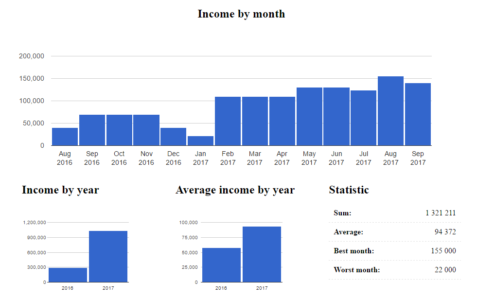
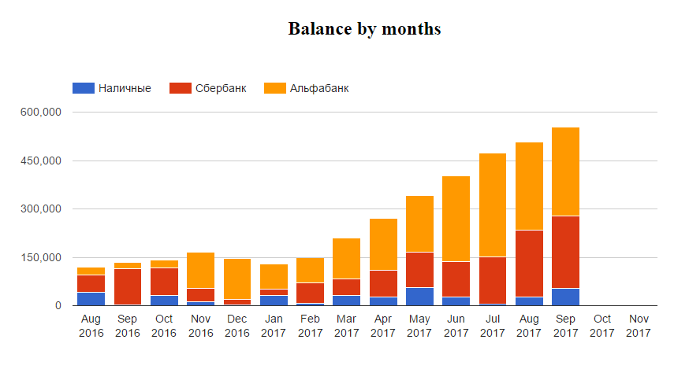

# Cromberg - personal finance accounting system

## Features

### Accounting of income

* Inserting income data with next fields: date, month, sum, type, contact, description
    * *Different between date and month: date - exact date of receive money; month - month, for which money you received*
* Income chart by months
* Calculating sum and average income by months, the best, worst and average month

### Balance
* Inserting balance data with different sources (*example: cash, account in A bank, electronic money*)
* Balance chart by months
* Costs chart by months (based on balance and income data)

### Other

* App's database by default storing in `%APPDATA%/Roaming/Cromberg/db/database` for Windows and similarly for others OS. You can change it in settings.
* Creating backup of database on every launch app, but not more ofter once a day. Backup folder you can set in settings.
* Email reminder every last day of month to fill balance data. Subscription and unsubscribing of notification by setting in app.
* Multi-language support: English, Russian and French

## Requirements

* Its need internet connection for correct work
* Supports Windows, MacOS, Linux

## Technology stack
* [Electron.js](https://github.com/electron/electron) - app
* [NeDB](https://github.com/louischatriot/nedb) - database
* PHP, MySQL - notification service

## Screenshots

